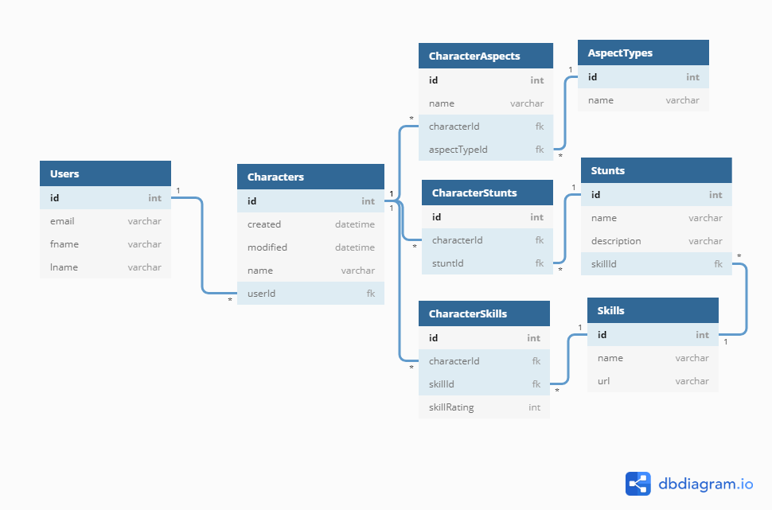

# Fate Character Codex

A [Nashville Software School C38](https://github.com/nss-day-cohort-38) front-end capstone project by [Keith Potempa](https://github.com/keithrpotempa)

## Setup

Steps to get started:
1. `git clone git@github.com:keithrpotempa/fate-character-codex.git`
1. `cd` into the directory it creates
1. `npm install` to build dependencies
1. `npm start` to run the application in development mode
1. start the json server in a new tab: `json-server -p 8200 api/database.json`
1. Open [http://localhost:3000](http://localhost:3000) to view it in the browser.

## Overview 

In this site, users can create, store, and view characters for [Fate Core](https://www.evilhat.com/home/fate-core/) a [tabletop roleplaying game](https://en.wikipedia.org/wiki/Tabletop_role-playing_game) by [Evil Hat Productions](https://www.evilhat.com).

(*) **Note: this is not true authentication.** There are no passwords used to login, and all credentials are saved in clear text on the JSON database. Do not use any sensitive information. 

## React Technologies Used

This project utilizes the following:
* This project was bootstrapped with [Create React App](https://github.com/facebook/create-react-app).
* [Semantic UI](https://semantic-ui.com/) for buttons, cards, containers,data-tooltips, dividers, dropdowns, forms, grids, icons, inputs, items, labels,lists, etc.
* [React Confirm Alert](https://www.npmjs.com/package/react-confirm-alert) for confirm alerts
* [React Router](https://reacttraining.com/react-router/) for page routing

## Other Technologies Used

1. React: hooks, state, props, routes, components, modules
1. API calls with: POST, PUT, PATCH, DELETE, and GET (with expand, embed)
1. Javascript: functions, objects, arrays, mapping
1. Persistent data storage with JSON Server
1. Github Scrum workflow
1. CSS styling
1. Modular code
1. Semantic HTML
1. [Valid HTML5](https://validator.w3.org/)

## Database Diagram
