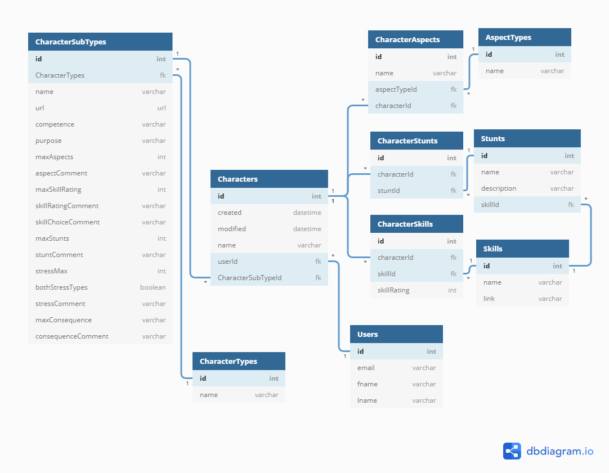

# Fate Character Codex

A [Nashville Software School C38](https://github.com/nss-day-cohort-38) front-end capstone project by [Keith Potempa](https://github.com/keithrpotempa)

## Overview 

In this site, users can create, store, and view characters for [Fate Core](https://www.evilhat.com/home/fate-core/) a [tabletop roleplaying game](https://en.wikipedia.org/wiki/Tabletop_role-playing_game) by [Evil Hat Productions](https://www.evilhat.com).

## Use Case

Creating characters in Fate is a [simple process](https://fate-srd.com/fate-core/character-creation) (at least compared to many other ttrpgs), so the publisher does not produce extensive libraries or resources of characters for use by players / game masters. This project hopes to provide an accessible resource to efficiently build characters; to help reduce the preparation time and overall accessibility of the game. 

Players and Game Masters can use Fate Character Codex to:
 - efficiently create characters of various different types
 - make decisions during character creation one step at a time, with short, relevant prompts from the rulebooks provided for each step
 - manage changes to saved characters throughout campaign play
 - track stress and consequences during a session
 - find characters and creatures created by other users to instantly use in their own games

## Character Types Supported 

[Fate Core:](https://www.evilhat.com/home/fate-core/)  
- Player Characters (PCs)
- Non-Player Characters (NPCs)
  - Nameless NPCs (Average, Fair, Good)
  - Supporting NPCs
  - Main NPC

[Fate Adversary Toolkit:](https://www.evilhat.com/home/fate-adversary-toolkit/) 
- Enemies
  - Threats
  - Hitters
  - Bosses
  - Fillers (Average, Fair, Good)

## React Technologies Used

This project utilizes the following:
* This project was bootstrapped with [Create React App](https://github.com/facebook/create-react-app).
* [Semantic UI](https://semantic-ui.com/) for React component buttons, cards, containers, dividers, dropdowns, forms, grids, icons, inputs, items, labels,lists, etc.
* [React Confirm Alert](https://www.npmjs.com/package/react-confirm-alert) for confirm alerts
* [React Router](https://reacttraining.com/react-router/) for page routing

## Other Technologies Used

1. React: hooks, state, props, routes, components, modules
1. API calls with: POST, PUT, PATCH, DELETE, and GET (with expand, embed)
1. Javascript: functions, objects, arrays, mapping
1. Persistent data storage with JSON Server
1. Github Scrum workflow
1. CSS styling
1. Modular code
1. Semantic HTML
1. [Valid HTML5](https://validator.w3.org/)

## Entity Relationship Diagram

## Local Setup
If you would like to test this code locally, you can follow these steps to get started:

1. `git clone git@github.com:keithrpotempa/fate-character-codex.git && cd fate-character-codex`
1. `npm install` to build dependencies
1. `npm start` to run the application in development mode

In a new terminal tab or window, 
1. `cd` back to the git directory
1. `mkdir api && cd $_`
1. `curl -o database.json https://raw.githubusercontent.com/keithrpotempa/fate-character-codex-database-seed/master/database.json`
1. `json-server -p 5002 database.json`

(*) **Note: this app does not use true authentication.** There are no passwords used to login, and all credentials are saved in clear text on the JSON database. Do not use any sensitive information. 

